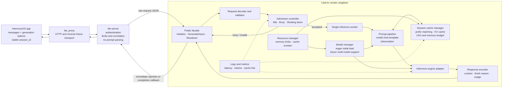
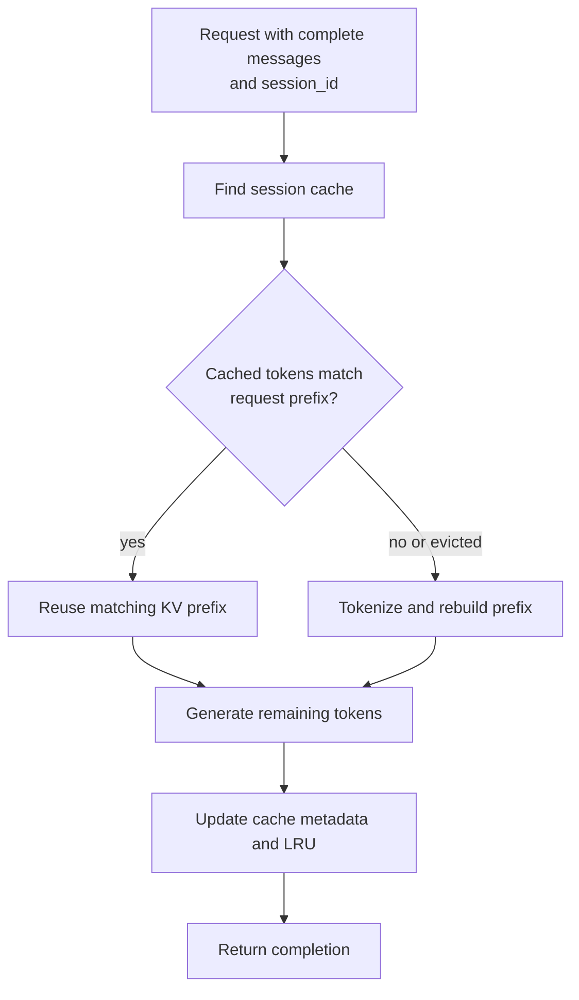

# The vendor now only exposes two interfaces to build the mod…

> The vendor now only exposes two interfaces to build the model and generate response. The generation interface only takes one string as input. This limits the functionalities of the vendor. For example, the vendor might need to manage multiple sessions, support multiple models and lora adapters, and enable prefix cache, constrained decoding and other techniques. Let's chat about this to enhance the vendor. Ask me questions about the vendor so you know better how it should look like.

The one-string generation API can remain a thin transport, while richer capabilities live behind a structured request protocol and vendor-managed state. Before designing that, I’d like to understand the current boundary.

Could you show me the two existing interface signatures and answer these first questions?

1. Where does the vendor run: in-process library, local service, device runtime, or remote server?
2. Does “build model” return a model handle, or does it establish global singleton state?
3. Can the generation string contain serialized structured data such as JSON, or must it be plain user text?
4. Are generation calls synchronous, streaming, or both?
5. Must existing callers remain fully backward compatible?

The most important initial question is whether that single string is merely a constrained transport envelope or is semantically required to be the user’s prompt. That determines whether we can build a clean protocol directly or need an internal compatibility/router layer.

> check the mock vendor in lite-server\vendor\lite_llm\mock. Also check how the server in ./lite-server currently use the vendor.

<details><summary>4 previous messages</summary>

> I’ll trace the mock vendor’s public surface and every server call site, then summarize the current lifecycle and the constraints it creates.
>
> <details><summary>Ran 2 commands</summary>
>
> - Ran `Get-ChildItem -Force; rg --files -g 'AGENTS.md' -g '!build' -g '!node_modules'; rg --files lite-server/vendor/lite_llm/mock; rg -n "lite_llm|vendor|build.*model|generate|inference" lite-server -g '!vendor/lite_llm/mock/**' -g '!build'`
> - Ran `Get-Content lite-server/vendor/lite_llm/mock/include/lite_llm.h; Get-Content lite-server/src/model.cpp; Get-Content lite-server/vendor/lite_llm/README.md; Get-Content lite-server/README.md; rg --files lite-server/src lite-server/include lite-server/tests; rg -n "Model|Build\(|Generate\(|GenerateResult|session|cache|request|prompt" lite-server/src lite-server/include lite-server/tests`
>
> </details>
>
> The current adapter is a singleton with a mutex, and the server discards most of the OpenAI request before it reaches the vendor. I’m checking the exact parsing and request loop now, because that decides where sessions, model selection, and decoding options could be preserved.
>
> <details><summary>Ran 2 commands</summary>
>
> - Ran `Get-Content lite-server/src/model.h; Get-Content lite-server/src/openai_chat.h; Get-Content lite-server/src/openai_chat.cpp; Get-Content lite-server/src/reverse_client.cpp; Get-Content lite-server/src/main.cpp; $lines = Get-Content lite-server/vendor/lite_llm/mock/lite_llm_mock.cpp; $lines[0..180]; $lines[360..470]`
> - Ran `rg -n '"endpoint"|"apiKey"|"model"' lite-server -g '*.json' -g '*.example' -g '*.md'; rg -n "CreateFromConfig|Generate\(|std::mutex|model_|ParseChatRequest|request->model|request->prompt|model_.Generate|while \(!should_stop_\(\)\)|BuildChatCompletion" lite-server/vendor/lite_llm/mock/include/lite_llm.h lite-server/vendor/lite_llm/mock/lite_llm_mock.cpp lite-server/src/model.cpp lite-server/src/openai_chat.cpp lite-server/src/reverse_client.cpp lite-server/src/main.cpp`
>
> </details>
</details>

I checked it. The current path is:

```text
OpenAI JSON request
  → lite-server extracts model + messages
  → messages are flattened with the Qwen3 chat template
  → one global LiteLlm instance
  → Generate(formatted_prompt)
  → completed string response
```

Key findings:

- The vendor’s operational API is `CreateFromConfig(configPath)` plus `Generate(prompt)` in [lite_llm.h](./lite-server/vendor/lite_llm/mock/include/lite_llm.h:9).
- The server builds exactly one vendor instance at startup and stores it in a `unique_ptr` in [model.cpp](./lite-server/src/model.cpp:20).
- Both building and generation are guarded by one mutex, so vendor calls are serialized in [model.cpp](./lite-server/src/model.cpp:41).
- The reverse-client loop is also synchronous: it receives one request, waits for generation, sends the response, and only then reads the next request in [reverse_client.cpp](./lite-server/src/reverse_client.cpp:263).
- `ParseChatRequest` retains only:
  - `model`
  - flattened message text

  Fields such as temperature, `max_tokens`, `stop`, tools, response format, adapter, session identifier, and cache controls are ignored in [openai_chat.cpp](./lite-server/src/openai_chat.cpp:64).
- The requested `model` does not select a vendor model. It is only echoed into the OpenAI response. The actual model is fixed by the startup configuration.
- The mock vendor reads one endpoint/model/API key and converts the already-formatted prompt into a single DeepSeek `user` message in [lite_llm_mock.cpp](./lite-server/vendor/lite_llm/mock/lite_llm_mock.cpp:444).
- There is no vendor-visible request ID, session ID, decoding configuration, streaming callback, cancellation signal, usage metadata, or structured error.

This means the first architectural decision is especially important:

**Are the two vendor method signatures permanently frozen, or can we redesign them while still keeping exactly two operations?**

If they are frozen, the practical solution is a versioned structured envelope passed through the one string:

```json
{
  "version": 1,
  "operation": "generate",
  "request_id": "...",
  "session_id": "...",
  "model": "...",
  "adapter": "...",
  "messages": [...],
  "sampling": {...},
  "cache": {...},
  "constraints": {...}
}
```

But I need your answers to these questions before settling on that design:

1. May `Generate` interpret its string as JSON, or must that string remain the literal tokenized prompt?
2. Can `CreateFromConfig` create several independent `LiteLlm` objects, or does the underlying vendor runtime have process-global/singleton state?
3. Should the vendor own conversation history, or should each request continue carrying the complete message history?
4. For multiple models, should several models remain loaded simultaneously, or may the vendor load and evict them under a memory budget?
5. Which constrained-decoding forms matter initially: JSON Schema, regex, grammar, fixed choices, or tool-call schemas?
6. Must legacy callers using `Generate("ordinary prompt")` continue working unchanged?

> we can redesign the vendor. we can also redesign the server, but ideally the server is a thin layer and just transport information from the app to the vendor. Answering your question: 1. json is acceptable 2. The vendor should be a singleton. If multiple models are needed, they should be managed by the vendor 3. choose the better option 4. the vendor will be deployed on a mobile device, so it's important to manage the resources. But for now support to multiple models is not in the top priority. 5. I don't know, we can talk about this more when we design this feature specifically. 6. no

Given those constraints, I’d make the vendor stateful for performance but not authoritative for conversation history.

The app should send the complete message history on every request, plus a stable `session_id`. The vendor uses that ID and the tokenized-prefix match to reuse KV cache. If the cache was evicted, the vendor restarted, or the request branched from an earlier turn, it can reconstruct the same result from the supplied messages.

That gives us:

- Reliable retries and recovery.
- Natural branching/editing of conversations.
- Vendor-managed KV/prefix caching.
- Resource eviction without losing the conversation.
- No need to synchronize two authoritative histories.

I would also move chat templating into the vendor. The server should not convert messages into a Qwen-formatted prompt because the correct template depends on the selected model.

A likely boundary is:

```cpp
class LiteLlm {
public:
    static LiteLlm& Instance();

    Result Initialize(std::string_view config_json);
    Result Execute(std::string_view request_json);
};
```

`Initialize` configures the runtime and model registry; it need not eagerly load every model. `Execute` accepts a versioned command. Initially that might only be `generate`, but the envelope leaves room for cancellation, cache management, model inspection, and later administrative operations.

For example:

```json
{
  "protocol_version": 1,
  "operation": "generate",
  "request_id": "req-123",
  "session_id": "conversation-42",
  "model": "qwen3-0.6b",
  "messages": [
    {"role": "system", "content": "Be concise."},
    {"role": "user", "content": "Hello"}
  ],
  "generation": {
    "max_new_tokens": 512,
    "temperature": 0.7,
    "top_p": 0.9
  },
  "cache": {
    "policy": "auto"
  }
}
```

The server would pass this JSON through without parsing messages, selecting models, or applying templates. It would retain only transport responsibilities: authentication, frame limits, request correlation, connection management, and possibly HTTP mapping.

The next pivotal questions are:

1. Should the app remain OpenAI API compatible, or can we define a vendor-native request format and update the app?
2. Is token streaming required? On a phone, waiting for the entire generation before displaying anything is usually a poor experience.
3. Must users be able to cancel an active generation?
4. Can two sessions generate concurrently, or should the vendor queue them and run only one inference job at a time?
5. Is the vendor library called from only this server process, or might other in-process clients call the singleton too?

Streaming and cancellation affect the C++ boundary significantly. A synchronous `Execute(string) -> string` can support rich generation options, sessions, and cache control, but it cannot provide good streaming or prompt cancellation without an event callback, polling interface, or asynchronous command protocol.

> 1. we can define a vendor-native request, but only if it brings big advantage over the opai compatible api so it really worth it. 2. For now token streaming is not required. 3. yes 4. one inference job at a time 5. the singleton is not shared by multiple clients.

I don’t think replacing the entire OpenAI request format is justified yet. Its generation vocabulary—`model`, `messages`, sampling parameters, stop conditions, and response formats—is useful and familiar.

The worthwhile proprietary part is a small versioned command envelope around it:

```json
{
  "version": 1,
  "operation": "generate",
  "request_id": "req-123",
  "session_id": "chat-42",
  "request": {
    "model": "qwen3-0.6b",
    "messages": [
      {"role": "user", "content": "Hello"}
    ],
    "max_completion_tokens": 512,
    "temperature": 0.7
  },
  "lite_llm": {
    "cache": {"mode": "auto"}
  }
}
```

This provides meaningful benefits without inventing another chat schema:

- Versioned vendor protocol.
- Explicit request and session identities.
- Non-generation operations such as cancellation.
- Namespaced future features such as LoRA and cache control.
- Most of the inner request remains OpenAI compatible.
- The server can pass the command through unchanged.

Cancellation could use:

```json
{
  "version": 1,
  "operation": "cancel",
  "request_id": "req-123"
}
```

There is one important concurrency consequence: cancellation must reach the vendor while `generate` is still blocked. Therefore either:

- The vendor exposes `Initialize`, `Generate`, and `Cancel`; or
- It keeps two methods, `Initialize` and a thread-safe `Execute(command_json)`, where one thread may be executing `generate` while another calls `Execute` with `cancel`.

I slightly prefer explicit `Generate` and `Cancel` methods because the concurrency contract is clearer. Keeping exactly two entry points is not valuable enough to obscure the API unless that is an external requirement.

The server would need two execution paths:

```text
Transport/I/O thread ── generate ──> inference worker ──> blocking vendor Generate
                     └─ cancel ─────> vendor Cancel immediately
```

Only the inference worker may run generation. Cancellation should set a vendor-owned atomic cancellation flag checked by the decoding loop. The original generation request should then finish with a structured `cancelled` result.

My next questions are:

1. Is preserving exactly two vendor entry points a requirement, or may we add an explicit cancellation method?
2. Does the underlying inference engine already support stopping generation between tokens?
3. When another generation arrives while one is active, should it be queued or rejected as busy?
4. If queued, should cancelling a request work for both active and queued requests?
5. Should the API boundary remain C++, or do you want a stable C ABI for the vendor `.so`? The existing `std::string`/`std::unique_ptr` boundary requires the server and vendor to use compatible C++ runtimes and compilers.

> 1. forget about current interfaces, it's ok to design it from scratch. 2. not yet 3. rejected 4. it's ok to use c++

That frees us to make the vendor genuinely asynchronous even though generation itself is non-streaming. An asynchronous completion callback is valuable because it lets the server continue receiving cancellation commands while inference runs.

I’d shape the API roughly like this:

```cpp
class LiteLlmRuntime {
public:
    static LiteLlmRuntime& Instance();

    Status Initialize(std::string_view configJson);

    // Non-blocking. The callback receives exactly one final JSON response.
    Status Dispatch(
        std::string requestJson,
        std::function<void(std::string responseJson)> completion);

    void Shutdown();
};
```

`Dispatch` handles versioned commands such as `generate`, `cancel`, and eventually model/cache operations. The vendor—not the server—parses commands, enforces the single-inference rule, manages session caches, and returns structured errors. A second generation while one is active receives `busy` immediately; it is never queued.

This keeps the server close to a transport adapter:

```text
app command → server framing/authentication → vendor Dispatch
vendor callback → server framing → app response
```

For cancellation, the current engine limitation matters:

- “Logical cancellation” can mark the request cancelled and discard its eventual result, but inference continues consuming resources.
- “Real cancellation” requires the decoding loop to periodically observe a cancellation flag and stop before producing the next token.

Since cancellation is a requirement, I recommend adding a cooperative stop hook to the engine. Until that exists, the vendor should report cancellation capability accurately rather than pretending that discarded output is true cancellation.

The public protocol should distinguish these results:

```json
{"status":"completed", "request_id":"req-1", "response":{...}}
{"status":"cancelled", "request_id":"req-1"}
{"status":"error", "request_id":"req-2", "error":{"code":"busy","message":"..."}}
```

A few remaining lifecycle questions:

1. Should `Initialize` eagerly load the initial model, so “ready” guarantees immediate generation, or load it on the first request?
2. During the interim before engine cancellation exists, should `cancel` perform logical cancellation or return `cancellation_not_supported`?
3. Does the app already have a stable conversation/session identifier that it can put in every request?
4. When `Shutdown` is called during generation, may it block until the engine stops, or must shutdown also interrupt inference?

> 1. do eagerly load 2. perform logical cancellation 3. check the codebase 4. interrupt inference. And I got a quesiton: what does the "completion" input of the Dispatch function do?

<details><summary>2 previous messages</summary>

> `completion` is a callback: `Dispatch` returns immediately, and the vendor calls that function later with the final result. That separation lets the server receive a cancel command while inference is still running. I’ll check whether the app already carries a stable conversation/session ID and then recommend whether this callback shape is still the best fit.
>
> <details><summary>Ran 8 commands</summary>
>
> - Ran `rg -n --hidden -S "sessionId|session_id|conversationId|conversation_id|chatId|chat_id|threadId|thread_id|requestId|request_id|OpenAiCompatibleModel|chat/completions|messages" entry agent_core lite_proxy tool-gateway lite-server -g '!**/build/**' -g '!**/.git/**' -g '!**/oh_modules/**'`
> - Ran `Get-Content agent_core/src/main/ets/model/OpenAiCompatibleModel.ets; Get-Content agent_core/src/main/ets/model/LocalModel.ets; Get-Content agent_core/src/main/ets/agent/ConversationContext.ets; rg -n -S "class .*Conversation|conversation|new ConversationContext|fromMessages|toChatMessages|reset|clear.*message|messages: ChatMessage\[\]" agent_core/src/main/ets entry/src/main/ets/pages/A2uiHome -g '!**/runtime/Gmail*' -g '!**/runtime/Social*'`
> - Ran `$p='entry/src/main/ets/pages/A2uiHome/Index.ets'; $lines=Get-Content $p; $lines[1560..1675]; $lines[3840..3950]; Get-Content agent_core/src/main/ets/aiphone/LoopBackend.ets -TotalCount 310; Get-Content agent_core/src/main/ets/agent/ConversationStore.ets; rg -n "interface .*Request|class .*Request|stableInstructions|history|conversation" agent_core/src/main/ets/aiphone entry/src/main/ets/pages/A2uiHome/Index.ets -g '*.ets' | Select-Object -First 180`
> - Ran `Get-Content agent_core/src/main/ets/aiphone/LoopBackendTypes.ets; rg -n "LoopBackendRequest|history:|surfaceId:|run\(|resetCurrentSession|appendMessage|new LoopBackend|backend.run|requestInStream|buildRequestJson|ConversationContext" entry/src/main/ets/pages/A2uiHome/Index.ets agent_core/src/main/ets/model/OpenAiCompatibleModel.ets agent_core/src/main/ets/agent/ConversationContext.ets agent_core/src/main/ets/aiphone/LoopBackendTypes.ets agent_core/src/main/ets/aiphone/LoopBackend.ets`
> - Ran `$p='entry/src/main/ets/pages/A2uiHome/Index.ets'; $lines=Get-Content $p; $lines[1080..1150]; $lines[1680..1840]; $lines[3400..3510]; rg -n "new LoopBackend|LoopBackend\(|\.run\(\{|run\(request|history: this|recentMessages\(\)" entry/src/main/ets agent_core/src/main/ets -g '*.ets'`
> - Ran `$p='entry/src/main/ets/model/LocalModelClient.ets'; $lines=Get-Content $p; $lines[180..290]; rg -n "interface A2uiMessage|export interface A2uiMessage|interface .*Message.*id|id: Date\.now|surfaceId" entry/src/main/ets/pages/A2uiHome agent_core/src/main/ets/aiphone/runtime/A2uiTypes.ets entry/src/main/ets/model/LocalModelClient.ets -g '*.ets' | Select-Object -First 120`
> - Ran `Get-Content agent_core/src/main/ets/agent/ReActAgentRunner.ets; Get-Content agent_core/src/main/ets/a2ui/OpenAiA2uiModel.ets; rg -n "cancel|abort|destroy\(\)|httpRequest|isBusy" entry/src/main/ets/model agent_core/src/main/ets/model entry/src/main/ets/pages/A2uiHome/Index.ets -g '*.ets' | Select-Object -First 150`
> - Ran `rg -n "chat_request|requestId|request_id|next.*id|pending|id:" lite_proxy/src/main/ets lite_proxy -g '*.ets' -g '*.cpp' -g '*.h' -g '!**/build/**' | Select-Object -First 180; rg -n "interface A2uiMessage|id: string|surfaceId: string" agent_core/src/main/ets/aiphone/runtime/A2uiTypes.ets`
>
> </details>
</details>

`completion` is a C++ callback, not part of the JSON input. The vendor stores it and calls it once when the asynchronous request finishes:

```cpp
runtime.Dispatch(requestJson,
    [requestId](std::string responseJson) {
        server.SendResponse(requestId, responseJson);
    });
```

The sequence is:

```text
Dispatch called
  → validates and accepts request
  → returns immediately
  → inference runs on vendor worker thread
  → vendor invokes completion(responseJson)
```

This lets the server continue reading transport messages—including cancellation—during inference.

I’d make the naming more explicit:

```cpp
using CompletionCallback =
    std::function<void(GenerationResult)>;

SubmitResult GenerateAsync(
    std::string requestJson,
    CompletionCallback onComplete);

CancelResult Cancel(std::string_view requestId);
```

This is clearer than a generic `Dispatch`. The server only routes generation and cancellation; all generation parsing and policy remain in the vendor.

The callback contract should guarantee:

- The vendor copies the callback before returning.
- Every accepted request invokes it exactly once.
- Rejected requests, such as `busy`, are returned synchronously and do not invoke it.
- The callback may run on a vendor-owned worker thread.
- No callback occurs after `Shutdown` returns.

### Session-ID check

The app does not currently have a stable LLM conversation identifier:

- [ConversationContext.ets](./agent_core/src/main/ets/agent/ConversationContext.ets:11) stores only message turns.
- [LoopBackendTypes.ets](./agent_core/src/main/ets/aiphone/LoopBackendTypes.ets:17) has history and a UI `surfaceId`, but no session or generation ID.
- [OpenAiCompatibleModel.ets](./agent_core/src/main/ets/model/OpenAiCompatibleModel.ets:168) sends the complete message history but no session ID.
- The UI creates per-message IDs and clears them on reset in [Index.ets](./entry/src/main/ets/pages/A2uiHome/Index.ets:1639). Those message IDs are not conversation IDs.
- The proxy creates a numeric ID for each HTTP request in [proxy_gateway.cpp](./lite_proxy/src/main/cpp/proxy_gateway.cpp:734). It is suitable for transport correlation, not stable session caching.

I recommend adding:

- `session_id`: generated when a conversation starts, retained across its turns, regenerated on “reset session.”
- `request_id`: newly generated for every model invocation.
- For the ReAct loop, every step gets a different `request_id` but shares the same `session_id`.

The complete message history should continue to be sent.

### Cancellation caveat

With no engine stop hook, logical cancellation can work like this:

1. Mark the request cancelled.
2. Invoke its completion callback with `cancelled`.
3. Discard any eventual model output.
4. Continue reporting `busy` until the underlying inference actually finishes.

However, “shutdown must interrupt inference” cannot safely be implemented with the current engine. C++ does not provide a safe way to kill an arbitrary inference thread. The engine needs a cooperative interruption point, normally checked between decoded tokens.

Once that hook exists, both shutdown and real request cancellation can use it. Until then, logical cancellation is possible, but interrupting shutdown requires terminating the entire server process.

My recommendation is therefore:

```cpp
Initialize(configJson);       // eagerly loads the model
GenerateAsync(json, callback);
Cancel(requestId);            // logical initially, cooperative later
Shutdown();                   // requires engine interrupt support
```

Does this explicit asynchronous API feel clearer than the generic `Dispatch(commandJson, completion)` design?

> The cancellation is making things complicated now. Maybe forget about the cancel for now. My consideration, is a request id really needed? in which scenario? I think a session id should be enough

Yes—under the simplified requirements, the vendor does not need a request ID.

A request ID becomes important for:

- Cancelling a particular request.
- Matching multiple concurrent asynchronous requests to responses.
- Deduplicating retries.
- Correlating detailed logs across components.

None is essential now because:

- Cancellation is deferred.
- Only one inference may run.
- The completion callback already identifies where the response belongs.
- The proxy already has its own transport request ID.

So the layers can use different identities:

```text
session_id          Vendor-visible; identifies conversation/cache state
proxy request ID    Server-only; correlates transport request and response
callback            Correlates the vendor result with that proxy request
```

A generation request can therefore be:

```json
{
  "version": 1,
  "session_id": "chat-42",
  "model": "qwen3-0.6b",
  "messages": [
    {"role": "system", "content": "Be concise."},
    {"role": "user", "content": "Hello"}
  ],
  "generation": {
    "max_new_tokens": 512,
    "temperature": 0.7
  }
}
```

The `session_id` is used only for optimization:

- Locate that session’s KV/prefix cache.
- Compare the incoming messages with the cached token prefix.
- Reuse the matching prefix.
- Rebuild if the history changed.
- Evict the cache when memory pressure requires it.

The messages remain the authoritative state.

I would retain the asynchronous API so the server can promptly reject a second request as busy:

```cpp
SubmitResult GenerateAsync(
    std::string requestJson,
    CompletionCallback onComplete);
```

`SubmitResult` is immediately either `accepted` or `busy`. If accepted, `onComplete` is called once later. No vendor request ID is needed.

We can add an opaque request handle or request ID later if cancellation, concurrent inference, or idempotent retries become requirements. The versioned JSON protocol gives us room to do that without disrupting the initial design.

> Looks good. Draw an outline for the vendor framework

<details><summary>2 previous messages</summary>

> I’m using the visualization skill because an architecture diagram will make the vendor boundary, scheduler, model runtime, and session cache responsibilities much easier to evaluate together.
>
> <details><summary>Ran a command</summary>
>
> - Ran `Get-Content 'C:\Users\mixup\.codex\plugins\cache\openai-bundled\visualize\1.0.16\skills\visualize\SKILL.md'`
>
> </details>
</details>

I’d keep the generation payload OpenAI-compatible and add a namespaced vendor extension. Without cancellation or other control commands, a completely proprietary request format brings little benefit.



### Public API

```cpp
class LiteLlmRuntime {
public:
    static LiteLlmRuntime& Instance();

    InitializeResult Initialize(std::string_view configJson);

    SubmitResult GenerateAsync(
        std::string requestJson,
        CompletionCallback onComplete);

    void Shutdown();
};
```

`Initialize`:

1. Validates runtime configuration.
2. Loads the configured model, tokenizer, and chat template eagerly.
3. Allocates required engine resources.
4. Returns ready only after the model can generate.

`GenerateAsync`:

1. Atomically rejects the request if the runtime is busy.
2. Validates the JSON.
3. Starts inference on the single worker.
4. Invokes `onComplete` once with the final response.
5. Returns the runtime to idle.

`Shutdown`:

1. Stops accepting requests.
2. Signals the engine’s shutdown-interruption hook.
3. Joins the inference worker.
4. releases session caches and model resources.

The engine still needs a cooperative interruption hook to guarantee shutdown during inference.

### Request shape

```json
{
  "model": "qwen3-0.6b",
  "messages": [
    {
      "role": "system",
      "content": "Be concise."
    },
    {
      "role": "user",
      "content": "Hello"
    }
  ],
  "temperature": 0.7,
  "max_completion_tokens": 512,
  "stream": false,
  "lite_llm": {
    "protocol_version": 1,
    "session_id": "550e8400-e29b-41d4-a716-446655440000",
    "cache": {
      "mode": "auto"
    }
  }
}
```

The vendor should return an ordinary OpenAI-compatible completion response. That allows the server to forward both directions without understanding messages, templates, generation settings, or cache behavior.

### Session-cache rule



The app’s messages remain authoritative. A cache miss, eviction, changed history, or vendor restart only affects performance—not correctness.

> For now the inference runtime can not be open-sourced yet(but will in the future). What're the minimal interfaces the runtime should expose now to support the vendor's functionality.

The proprietary inference runtime only needs three operations now:

```cpp
class InferenceRuntime {
public:
    virtual ~InferenceRuntime() = default;

    // Synchronous; loads model and tokenizer before returning success.
    virtual RuntimeResult Initialize(const RuntimeConfig& config) = 0;

    // Synchronous and blocking. Only one call may be active.
    virtual GenerateResult Generate(const GenerateRequest& request) = 0;

    // Thread-safe. Interrupts Generate, waits for it to exit, then releases resources.
    virtual void Shutdown() noexcept = 0;
};
```

The vendor wraps blocking `Generate` with its worker thread and completion callback:

```text
Server
  → Vendor GenerateAsync
  → admission check
  → vendor worker
  → Runtime Generate (blocking)
  → vendor completion callback
  → Server response
```

### Runtime configuration

```cpp
struct RuntimeConfig {
    std::string model_path;
    std::string tokenizer_path;

    std::size_t max_context_tokens;
    std::size_t kv_cache_budget_bytes;

    std::uint32_t worker_threads;
};
```

`Initialize` must:

- Load the initial model eagerly.
- Load its tokenizer.
- Allocate essential runtime resources.
- Configure the KV-cache memory ceiling.
- Return success only when generation is ready.

Model IDs, registries, JSON parsing, and future multi-model policy stay in the vendor.

### Generation request

```cpp
enum class CachePolicy {
    Disabled,
    Auto
};

struct GenerationOptions {
    std::uint32_t max_new_tokens = 512;
    float temperature = 0.7F;
    float top_p = 0.9F;
    std::uint32_t top_k = 0;
    std::vector<std::string> stop;
    std::optional<std::uint64_t> seed;
};

struct GenerateRequest {
    std::string session_id;

    // Already converted by the vendor using the model's chat template.
    std::string prompt;

    GenerationOptions options;
    CachePolicy cache_policy = CachePolicy::Auto;
};
```

The runtime should not receive vendor JSON or OpenAI messages. The vendor owns:

- JSON validation.
- Protocol versioning.
- OpenAI compatibility.
- Model selection.
- Model-specific chat templates.
- Defaulting and limiting generation options.

The runtime owns tokenization because prefix-cache correctness depends on the actual token sequence.

### Generation result

```cpp
enum class RuntimeStatus {
    Ok,
    InvalidArgument,
    ContextTooLong,
    OutOfMemory,
    Interrupted,
    InternalError
};

enum class FinishReason {
    Stop,
    Length,
    Interrupted
};

struct TokenUsage {
    std::uint32_t prompt_tokens = 0;
    std::uint32_t generated_tokens = 0;
    std::uint32_t reused_prefix_tokens = 0;
};

struct GenerateResult {
    RuntimeStatus status;
    std::string text;
    FinishReason finish_reason;
    TokenUsage usage;
    std::string error;
};
```

`reused_prefix_tokens` lets the vendor report cache effectiveness without exposing internal KV-cache objects.

### Prefix-cache ownership

For the minimal boundary, the runtime should manage physical KV caches internally:

```text
session_id
  → tokenized prompt prefix
  → engine-specific KV blocks
  → last-used time and memory consumption
```

For each request, it should:

1. Tokenize the complete prompt.
2. Find the session cache.
3. Verify the reusable token prefix.
4. Reuse valid KV blocks or rebuild them.
5. Update the cache after generation.
6. Evict least-recently-used sessions to remain under `kv_cache_budget_bytes`.

This avoids exposing unstable, engine-specific cache handles through the closed-source boundary.

### What not to expose yet

The runtime does not currently need:

- An asynchronous generation API.
- Callbacks.
- Request IDs.
- JSON parsing.
- Busy-state handling.
- Streaming tokens.
- Explicit cancellation.
- Model listing or dynamic model loading.
- LoRA management.
- Grammar or constrained-decoding APIs.
- Public KV-cache handles.

The only new engine capability that is essential is the shutdown-interruption contract: `Shutdown()` must be callable from another thread and cause an active `Generate()` to return `Interrupted` safely.

> save the key structs and interfaces in lite-server\vendor\lite_llm\design. I'll make changes and comments.

<details><summary>6 previous messages</summary>

> I’ll add a compact design header containing both boundaries: the server-facing vendor singleton and the vendor-to-inference-runtime interface, with contracts documented where the behavior matters. I’ll keep it non-buildable by default so you can revise it freely before implementation.
>
> <details><summary>Ran a command</summary>
>
> - Ran `Get-ChildItem -Force lite-server/vendor/lite_llm; if (Test-Path lite-server/vendor/lite_llm/design) { Get-ChildItem -Force lite-server/vendor/lite_llm/design }; git status --short`
>
> </details>
>
> The design will separate two contracts: a JSON-preserving asynchronous vendor API for the thin server, and a small typed synchronous API for the proprietary runtime. This keeps OpenAI/protocol concerns out of the inference engine.
>
> <details><summary>Created 3 files, ran 2 commands</summary>
>
> - Wrote `./lite-server/vendor/lite_llm/design/README.md` (+60 -0)
> - Wrote `./lite-server/vendor/lite_llm/design/inference_runtime.h` (+132 -0)
> - Wrote `./lite-server/vendor/lite_llm/design/vendor_api.h` (+84 -0)
> - Ran `Get-ChildItem lite-server/vendor/lite_llm/design; Get-Content lite-server/vendor/lite_llm/design/vendor_api.h; Get-Content lite-server/vendor/lite_llm/design/inference_runtime.h; Get-Content lite-server/vendor/lite_llm/design/README.md`
> - Ran `$compiler = Get-Command clang++ -ErrorAction SilentlyContinue; if ($null -eq $compiler) { Write-Output 'clang++ not available; skipped standalone syntax check' } else { clang++ -std=c++17 -fsyntax-only -x c++-header lite-server/vendor/lite_llm/design/vendor_api.h; clang++ -std=c++17 -fsyntax-only -x c++-header lite-server/vendor/lite_llm/design/inference_runtime.h }`
>
> </details>
>
> The draft files are in place. A standalone host `clang++` check cannot find a configured C++ standard library in this shell, so I’m checking the project’s existing HarmonyOS compiler configuration rather than treating that environment issue as a code error.
>
> <details><summary>Ran 6 commands</summary>
>
> - Ran `rg --files lite-server -g 'compile_commands.json' -g 'build.ninja' -g 'CMakeCache.txt'; Get-ChildItem lite-server -Directory | Select-Object -ExpandProperty FullName; Get-Content lite-server/scripts/build.ps1 -TotalCount 140`
> - Ran `Get-ChildItem -Force lite-server/build-x86_64 | Select-Object -First 30; Get-ChildItem -Force lite-server/build-arm64-v8a | Select-Object -First 30`
> - Ran `rg -n -m 3 "model.cpp.*\.o|CXX_COMPILER" lite-server/build-x86_64/build.ninja; rg -n "CMAKE_CXX_COMPILER:FILEPATH|CMAKE_SYSROOT|CMAKE_CXX_FLAGS" lite-server/build-x86_64/CMakeCache.txt`
> - Ran `rg -n -A8 "rule CXX_COMPILER__lite_server_core_unscanned_Debug" lite-server/build-x86_64/CMakeFiles/rules.ninja; rg -n "FLAGS =|INCLUDES =|DEFINES =" lite-server/build-x86_64/build.ninja | Select-Object -First 25`
> - Ran `& 'D:\Applications\DevEco Studio\sdk\default\hms\native\BiSheng\bin\clang++.exe' --target=x86_64-linux-ohos --gcc-toolchain='D:/Applications/DevEco Studio/sdk/default/hms/native/BiSheng' --sysroot='D:/Applications/DevEco Studio/sdk/default/openharmony/native/sysroot' -I'D:/Applications/DevEco Studio/sdk/default/hms/native/sysroot/usr/include' -D__MUSL__ -std=c++17 -Wall -Wextra -Wpedantic -fsyntax-only -x c++-header lite-server/vendor/lite_llm/design/vendor_api.h; if ($LASTEXITCODE -ne 0) { exit $LASTEXITCODE }; & 'D:\Applications\DevEco Studio\sdk\default\hms\native\BiSheng\bin\clang++.exe' --target=x86_64-linux-ohos --gcc-toolchain='D:/Applications/DevEco Studio/sdk/default/hms/native/BiSheng' --sysroot='D:/Applications/DevEco Studio/sdk/default/openharmony/native/sysroot' -I'D:/Applications/DevEco Studio/sdk/default/hms/native/sysroot/usr/include' -D__MUSL__ -std=c++17 -Wall -Wextra -Wpedantic -fsyntax-only -x c++-header lite-server/vendor/lite_llm/design/inference_runtime.h`
> - Ran `& 'D:\Applications\DevEco Studio\sdk\default\hms\native\BiSheng\bin\clang++.exe' --target=x86_64-linux-ohos --sysroot='D:/Applications/DevEco Studio/sdk/default/openharmony/native/sysroot' -I'D:/Applications/DevEco Studio/sdk/default/hms/native/sysroot/usr/include' -D__MUSL__ -std=c++17 -Wall -Wextra -Wpedantic -fsyntax-only -x c++ lite-server/vendor/lite_llm/design/vendor_api.h; if ($LASTEXITCODE -ne 0) { exit $LASTEXITCODE }; & 'D:\Applications\DevEco Studio\sdk\default\hms\native\BiSheng\bin\clang++.exe' --target=x86_64-linux-ohos --sysroot='D:/Applications/DevEco Studio/sdk/default/openharmony/native/sysroot' -I'D:/Applications/DevEco Studio/sdk/default/hms/native/sysroot/usr/include' -D__MUSL__ -std=c++17 -Wall -Wextra -Wpedantic -fsyntax-only -x c++ lite-server/vendor/lite_llm/design/inference_runtime.h`
>
> </details>
</details>

Saved the design draft under [design](./lite-server/vendor/lite_llm/design/README.md):

- [vendor_api.h](./lite-server/vendor/lite_llm/design/vendor_api.h) — server-facing singleton and asynchronous generation contract.
- [inference_runtime.h](./lite-server/vendor/lite_llm/design/inference_runtime.h) — minimal proprietary runtime structs and interface.
- [README.md](./lite-server/vendor/lite_llm/design/README.md) — boundary decisions, request format, and flow.

Both headers pass a C++17 syntax check using the configured HarmonyOS x86_64 toolchain. They are not connected to the current build.

